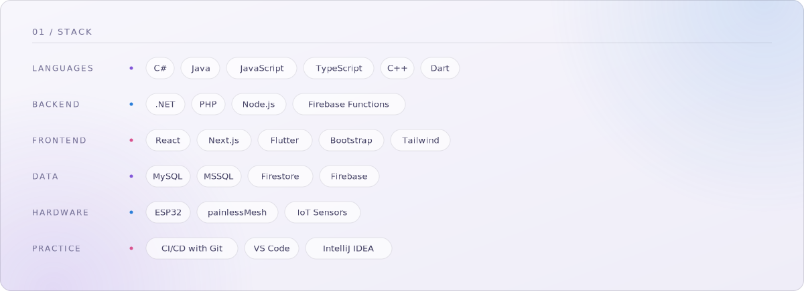
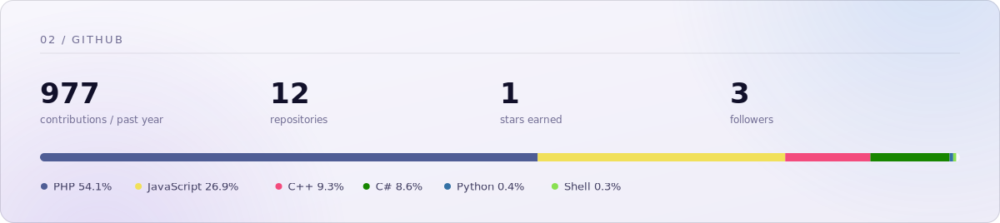

<picture>
  <source media="(prefers-color-scheme: dark)" srcset="assets/hero-dark.svg">
  
</picture>

  <em>Building thoughtful digital systems for the real world.</em> 
  more at <a href="https://manulasameera.dev">manulasameera.dev</a>

<picture>
  <source media="(prefers-color-scheme: dark)" srcset="assets/stack-dark.svg">
  
</picture>

<picture>
  <source media="(prefers-color-scheme: dark)" srcset="assets/stats-dark.svg">
  
</picture>

  
    <a href="https://manulasameera.dev">manulasameera.dev</a>
    &nbsp;·&nbsp;
    <a href="https://www.linkedin.com/in/manula-sameera">LinkedIn</a>
  

